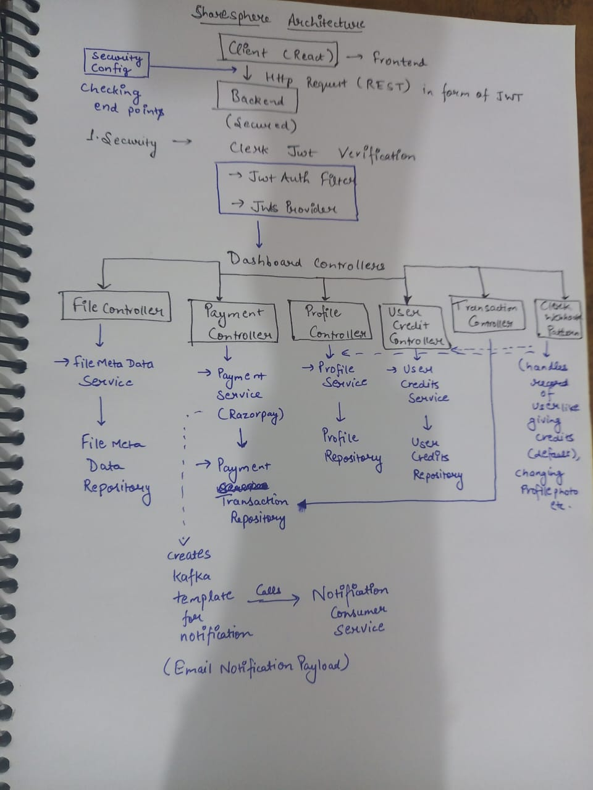
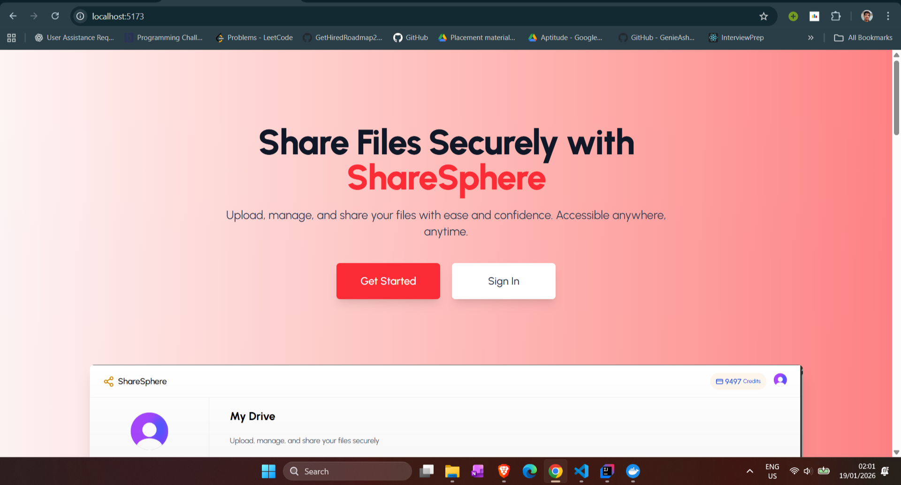
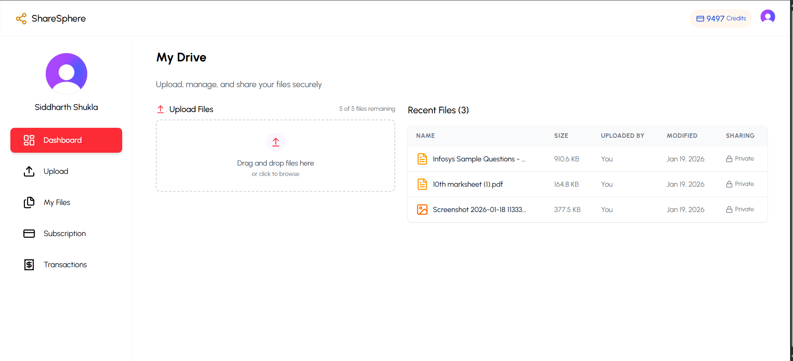
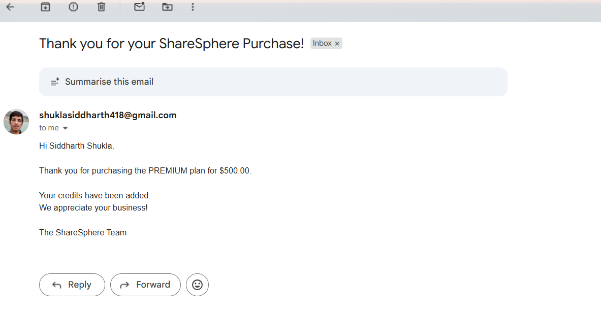

## Overview
ShareSphere is a cloud-based file sharing platform similar to Google Drive, allowing users to upload, manage, and share files securely with a credit-based subscription model.

## Features
- Secure file upload and management
- JWT-based authentication using Clerk
- Credit-based subscription system
- Razorpay payment integration
- Kafka-based email notifications after purchase
- public and private making facility
- shareable links for files

## Tech Stack
- Backend: Spring Boot, Java 21
- Frontend: React
- Auth: Clerk
- Messaging: Apache Kafka
- Payments: Razorpay
- Database: MongoDB
- Cloud: (local for now)

## Architecture


## Setup Instructions(locally)
- install java 21 and node version 22+
- install intellij idea for backend and for frontend download vscode, for database download monogodb compass and for setting up notification service download docker desktop and kafka
> ⚠ If Kafka is not running, email notifications will be skipped but core functionality will still work.
``` bash
  git clone https://github.com/Siddharth3271/cloudShareWebApp
  cd sharesphere-backend
```
- make a separate folder for a project and then open terminal in that folder and type above command in the terminal
- then open the backend folder in intellij and frontend folder in vs code
- edit the application properties in backend after generating your respective credentials
- > ⚠ Make sure you add your app password which is different from gmail password
```bash
  docker-compose up -d
```
- open terminal where docker file exist
- type above command in the terminal to start docker
- then go to intellij and run the project
- after that go to frontend folder and type below commands
```
npm install
npm run dev
```
- this will start the frontend

## Application ScreenShots




## Future Work
- adding spring ai feature for chatting with documents uploaded
  
